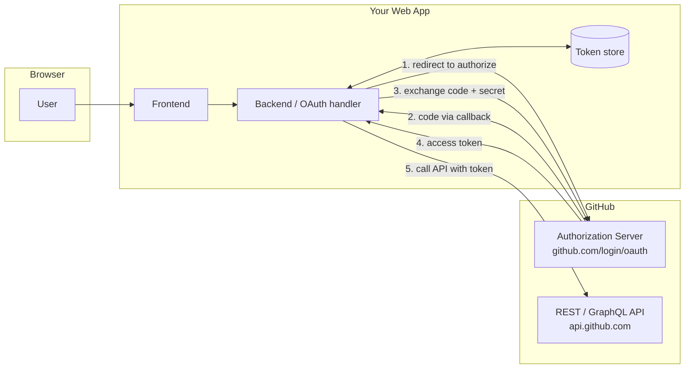
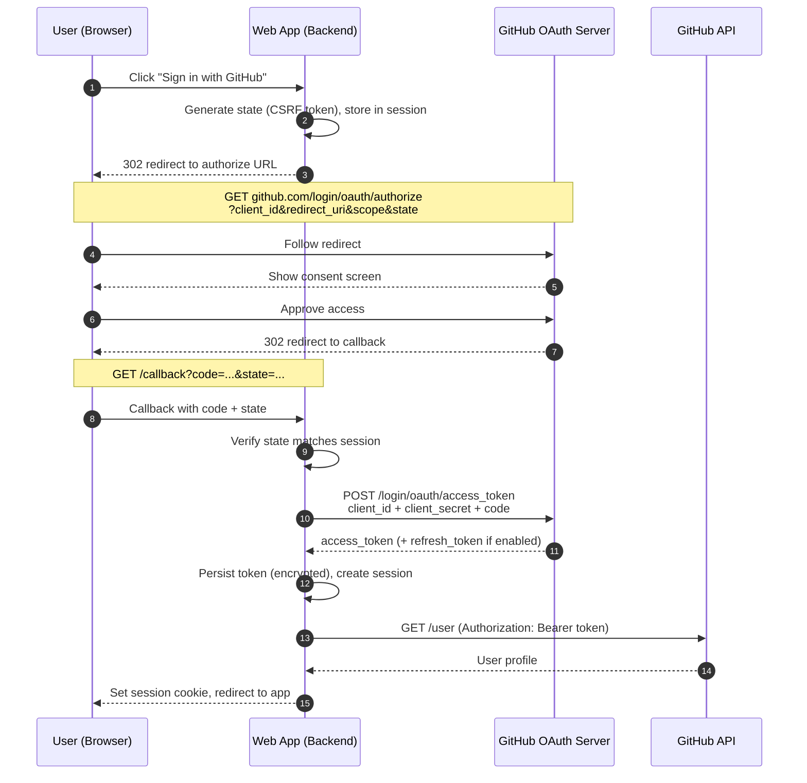

# GitHub OAuth — Architecture

Standard GitHub OAuth 2.0 **Authorization Code** flow for a web application.

## Components



## Authorization Code Flow



## Key Parameters

| Parameter        | Where                | Purpose                                              |
| ---------------- | -------------------- | ---------------------------------------------------- |
| `client_id`      | Authorize + token    | Public identifier of the OAuth app.                  |
| `client_secret`  | Token exchange only  | Proves the backend's identity. **Never expose.**     |
| `redirect_uri`   | Authorize            | Callback URL; must match the app's registered URI.   |
| `scope`          | Authorize            | Requested permissions (e.g. `read:user repo`).       |
| `state`          | Authorize + callback | CSRF protection; opaque value verified on return.    |
| `code`           | Callback             | Short-lived, single-use; exchanged for a token.      |
| `access_token`   | Token response       | Bearer credential for API calls.                     |

## Security Notes

- The `client_secret` and the code-for-token exchange **must** happen server-side; never in the browser.
- Always generate and verify `state` to defend against CSRF on the callback.
- Validate `redirect_uri` strictly — it must match the value registered with the OAuth app.
- Treat the `code` as single-use and short-lived; exchange it immediately.
- Store access tokens encrypted at rest and scope them to the minimum permissions needed.
```
